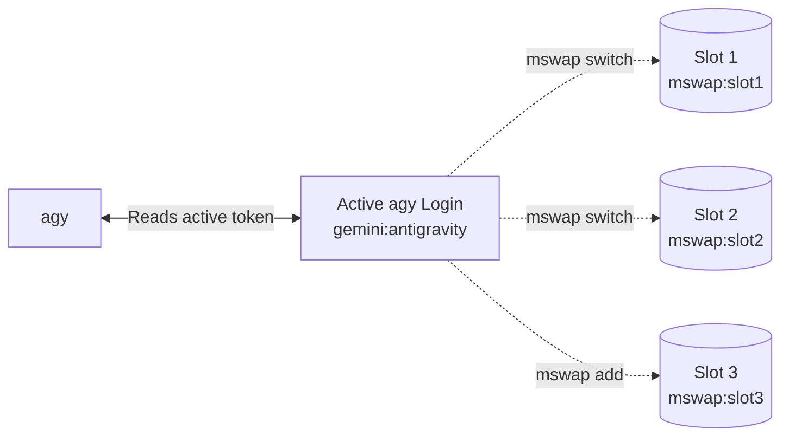

<p align="center">
  <picture>
    <source media="(prefers-color-scheme: dark)" srcset="docs/assets/logo-dark.svg" />
    
  </picture>
</p>

<p align="center">
  <strong>Unbreakable agy sessions: multi-account switcher, usage dashboard and autopilot for Google's Antigravity CLI.</strong>
</p>

<p align="center">
  <a href="https://github.com/shaurya-disciplined/mswap/actions/workflows/ci.yml"></a>
  <a href="https://github.com/shaurya-disciplined/mswap/releases"></a>
  <a href="LICENSE"></a>
  
  
</p>

<p align="center">
  
</p>

## Why

Antigravity (`agy`) quota windows often run out mid-work, blocking your flow. Switching Google accounts by hand requires `/logout`, opening a browser window, and risking lost session context.

`mswap` fixes this. It stores your accounts safely in your OS credential manager, shows you exactly how much 5-hour and weekly quota you have left across all of them, and switches instantly—even automatically right before a limit stops your work.

## Install

### Windows
```powershell
irm https://raw.githubusercontent.com/shaurya-disciplined/mswap/main/scripts/install.ps1 | iex
```

### macOS & Linux
```bash
curl -fsSL https://raw.githubusercontent.com/shaurya-disciplined/mswap/main/scripts/install.sh | sh
```

### Manual (uv tool)
```bash
uv tool install git+https://github.com/shaurya-disciplined/mswap
```

## Quick Start

Get two accounts working in 60 seconds:

1. **Sign in to your first account in agy**:
   ```console
   $ agy
   ```
2. **Save your first account**:
   ```console
   $ mswap add --alias work
   ✓ Added account 1: alice@example.com
     To add another: `mswap add --new`. Don't use agy's /logout, it can revoke saved logins.
   ```
3. **Prepare agy for a fresh sign-in**:
   ```console
   $ mswap add --new
   ✓ Updated account 1: alice@example.com
   ✓ Signed agy out on this PC only. The saved copy stays valid.
     Now run agy, sign in with the next Google account, then run mswap add.
   ```
4. **Sign in to your second account, then save it**:
   ```console
   $ agy
   $ mswap add --alias personal
   ✓ Added account 2: bob@example.com
   ```
5. **View your dashboard**:
   ```console
   $ mswap list
   mswap · agy accounts

      1  alice@example.com  · alias work
        Gemini        5h    ━━━━━━━━━━━─  92% left  resets 04:16 (4h 11m)
                      week  ━━━━━━━━━━━─  98% left  resets Thu 08 Oct 18:04 (5d 17h)
        Claude & GPT  5h    ━━━━━━━━━━━━ 100% left
                      week  ━━━━━━━━━━━━ 100% left

    ▸ 2  bob@example.com (active)  · alias personal
        Gemini        5h    ━━━━━───────  45% left  resets 02:34 (2h 29m)
                      week  ━━━━━━━━────  72% left  resets Tue 06 Oct 08:04 (3d 7h)
        Claude & GPT  5h    ━━━━━━━━━━──  85% left  resets 03:14 (3h 9m)
                      week  ━━━━━━━━━━──  90% left  resets Wed 07 Oct 14:04 (4d 13h)
   ```
6. **Switch back**:
   ```console
   $ mswap switch 1
   ✓ Switched agy to account 1: alice@example.com
     New agy sessions use it. Restart any agy that's already running.
   ```
7. **Turn on autopilot**:
   ```console
   $ mswap hook install
   ✓ Installed hook set 'mswap-autopilot'.
     hooks.json: ~/.gemini/antigravity-cli/hooks.json
     Your other hooks are untouched.
   ```
   By default, the hook only notifies you when your quota is low. To enable automatic switching, run `mswap config set autopilot.hook_action switch`.
   A switch changes the login for the next agy start. An agy session that is already running may keep the account it started with, so continue the conversation with `agy -c` after the turn ends.
   Alternatively, you can run `mswap auto` in a separate terminal for a continuous foreground autopilot loop.

## Features and Commands

| Command | Description |
|---|---|
| `mswap add [--new] [--alias NAME]` | Save the account agy is signed in to now (`--new` signs agy out) |
| `mswap list [--refresh]` | Show all accounts and remaining 5h/weekly quota |
| `mswap switch [SELECTOR]` | Rotate to the next account or switch to a specific one |
| `mswap remove SELECTOR [--yes]` | Remove a saved account |
| `mswap alias SELECTOR [NAME]` | Set or clear (`--clear`) an account alias |
| `mswap disable` / `enable SELECTOR` | Exclude or include an account in automatic rotation |
| `mswap current` | Show the active account |
| `mswap status [--format FMT]` | Cache-only one-liner for shell prompts |
| `mswap watch` | Live updating dashboard |
| `mswap auto [--once] [--dry-run]` | Foreground autopilot loop |
| `mswap hook install\|remove\|status` | Manage the `agy` Stop-hook for autopilot |
| `mswap schedule install\|remove\|status` | Background autopilot via Task Scheduler |
| `mswap shim install [--force]` | Write a Smart App Control-safe `mswap.cmd` |
| `mswap log [-n N]` | Show audit trail of switches and autopilot |
| `mswap config [get\|set\|unset\|path\|list]` | Manage `settings.toml` |
| `mswap export FILE [--accounts SEL,...]` | Export accounts to an encrypted bundle |
| `mswap import FILE [--force]` | Import accounts from an encrypted bundle |
| `mswap completions SHELL` | Print a completion script (`powershell`, `bash`, `zsh`, `fish`) |
| `mswap doctor [--repair] [--online]` | Diagnose environment and accounts |
| `mswap debug record [--out DIR]` | Save secret-free API response shapes for bug reports |

## How it works

`mswap` uses the native OS credential manager to keep your tokens secure.



When you run `mswap switch`, it swaps the token currently in the `gemini:antigravity` OS credential slot with the token in your chosen `mswap:slotX` slot, transactionally.

## Safety Model

- **Your tokens stay in the OS**: Windows Credential Manager (`advapi32`), macOS Keychain Services, or Linux Secret Service.
- **Zero tokens on disk**: Configuration files (`accounts.json`, `settings.toml`) never store OAuth refresh tokens or access tokens.
- **Transactional safety**: Before every switch, `mswap` backs up your current state to `mswap:backup-last`. If an error occurs, it rolls back. Run `mswap doctor --repair` to fix an interrupted state.
- **Unobtrusive**: `mswap` never touches Git credentials, browser profiles, or MCP servers.
- **Concurrency aware**: If `agy` is currently running in another terminal, `mswap switch` will warn you that active sessions may keep using the old account until restarted. You can use `--wait` to wait for them to finish, or `--resume` to immediately restart your session with `agy -c`. If you run `mswap switch` from *inside* agy, it is blocked unless you use `--force`.

## Platform Support

| Platform | Credential Backend | Status |
|---|---|---|
| **Windows** | Windows Credential Manager (`advapi32`) | **Supported** |
| **macOS** | Keychain Services (`security` CLI) | **Supported** |
| **Linux** | Secret Service (`secret-tool`) | **Supported** |
| **Linux (Headless)** | File Vault fallback (`MSWAP_VAULT=file`) | **Experimental** (opt-in unencrypted fallback) |

## FAQ and Troubleshooting

### What happens to my quota? (Gemini vs Claude & GPT)
Switching Google accounts shifts your Antigravity session to the new account's quota pool. Each account has its own quotas for Gemini, Claude, and GPT models. `mswap` helps you monitor these pools from one place.

### I'm getting a Smart App Control warning on Windows
Unsigned executables might be blocked by Windows Smart App Control. Use `mswap shim install` to create a lightweight `.cmd` launcher that bypasses this restriction safely by calling `python -m mswap` directly.

### Why do I see "agy is running"?
Tokens are loaded into `agy` at launch. Switching out the active token while `agy` is mid-thought could break its session. Wait for `agy` to finish its run, then `mswap switch`.

### Can I just use agy's `/logout`?
Running `/logout` can completely revoke the token from Google's servers. The next time you want to use it, you'll have to complete the browser sign-in flow again. `mswap` saves the valid token safely and swaps it locally without revoking it, saving you the browser trip.

### Where can I find more help?
For more advanced issues, see the [Troubleshooting Guide](docs/troubleshooting.md) or run `mswap doctor --repair` to fix an interrupted state.

## Contributing

1. Fork the repository
2. Create a branch for your feature (`git checkout -b feature/my-feature`)
3. Make your changes and run the tests (`uv run pytest`)
4. Open a Pull Request
5. Meteor reviews and merges the PR!

See [CONTRIBUTING.md](CONTRIBUTING.md) for more details.

## Support

- Found a bug or need help? DM me on Discord: **tut.meteor**
- Open a [GitHub Issue](https://github.com/shaurya-disciplined/mswap/issues).
- For security issues, please do not use public issues. Follow the instructions in [SECURITY.md](SECURITY.md).

---

## Disclaimer

mswap is an independent project, not affiliated with or endorsed by Google. Antigravity is a trademark of Google LLC. mswap reads and writes only your own agy login on your own machine. Using several accounts may be subject to Google's terms. You are responsible for how you use it.

---

Built by Meteor · TUT: The Unbreakable Titan
<br>
MIT License
