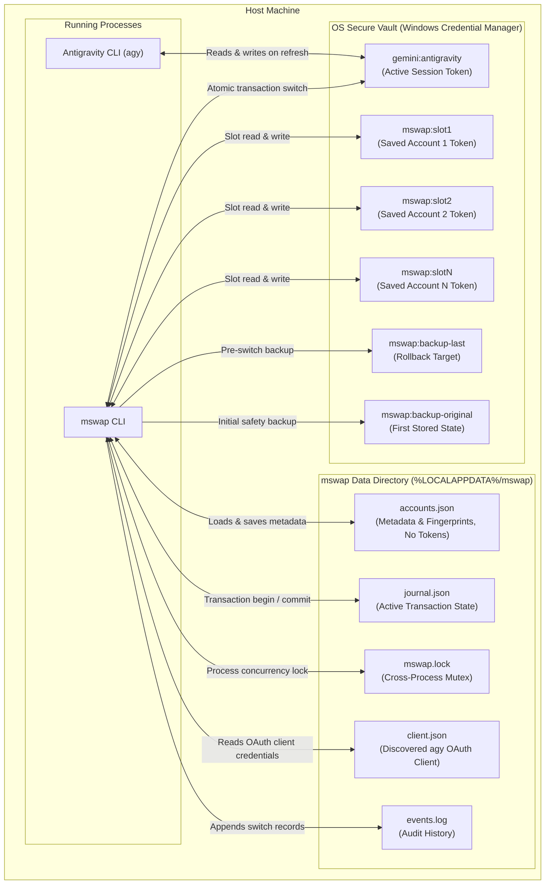
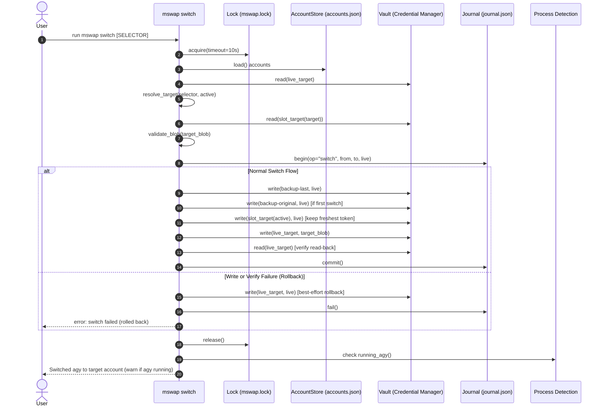

# How mswap Works

`mswap` is an account switcher, quota viewer, and safety layer for Google's Antigravity CLI (`agy`). It lets you switch between multiple Google accounts in seconds without losing active context, revoking tokens, or going through browser authentication prompts.

This document describes `mswap`'s architecture, storage model, and transaction lifecycle.

---

## Architecture Overview

`mswap` is built with pure Python standard library: zero external runtime dependencies. It never intercepts agy traffic, never proxies network requests, and never touches browser cookies or external developer credentials (like GitHub CLI `gh`).

---

## Where Data Lives

`mswap` splits operational state cleanly into two boundaries:

1. **Credential Vault (OS Native Secret Store)**:
   - On Windows, credentials live in Windows Credential Manager encrypted via Windows DPAPI.
   - `gemini:antigravity`: The live credential read and written by `agy.exe`.
   - `mswap:slot1`, `mswap:slot2`, ...: Saved account tokens managed by `mswap`.
   - `mswap:backup-last`: Copy of the live credential prior to the most recent switch.
   - `mswap:backup-original`: Permanent backup taken before `mswap` performed its first mutation.
   - Plaintext tokens never touch filesystem files on disk.

2. **Data Directory (`%LOCALAPPDATA%\mswap`)**:
   - `accounts.json`: Schema version 2 metadata file. Stores slot numbers, account email addresses, aliases, disabled states, and SHA-256 token fingerprints. Does not contain OAuth tokens or secrets.
   - `journal.json`: Records in-flight switch transactions for automatic recovery on startup.
   - `mswap.lock`: Cross-process mutex file preventing race conditions during concurrent operations.
   - `client.json`: Discovered agy OAuth client ID and secret extracted from `agy.exe`.
   - `events.log`: Local append-only event log recording switch actions and timestamps.

---

## The Switch Transaction Protocol

Every account switch is a journaled, atomic transaction. If `mswap` or the operating system crashes mid-operation, the next run of `mswap` detects the incomplete transaction and automatically rolls back.

### Transaction Steps

1. **Locking**: `mswap` acquires an exclusive file lock (`mswap.lock`) with a 10-second timeout.
2. **Pre-flight Validation**:
   - Ensures target account exists and is not quarantined.
   - Validates that target credential JSON has a valid refresh token.
   - Verifies whether agy is logged into an unsaved account. If an unknown account is active, `mswap` refuses to overwrite it unless `--force` is passed.
3. **Journal Initiation**: Records `op="switch"`, `from_fp`, `to_fp`, and `live_fp` into `journal.json` with status `pending`.
4. **Backup**:
   - Saves current live credential to `mswap:backup-last`.
   - If `mswap:backup-original` does not exist, saves current live credential there as a permanent safety point.
   - Saves freshest live token back into the slot of the account being left.
5. **Atomic Write & Verification**:
   - Writes the target account's credential blob to `gemini:antigravity`.
   - Reads back `gemini:antigravity` and verifies bit-for-bit equality.
   - If read-back fails or writing raises an error, `mswap` immediately rolls back by writing the original live blob back to `gemini:antigravity`, marks the journal failed, and aborts.
6. **Commit**: Updates journal status to `committed`.
7. **Process Awareness**: Inspects running processes. If active `agy.exe` instances are detected, warns the user that running sessions keep tokens in memory until restarted.

---

## Running agy Sessions & Process Detection

When switching accounts:

- `agy` loads credentials into memory upon starting a turn or refreshing tokens.
- If `agy.exe` is running while you run `mswap switch`, `mswap` detects running agy instances via native Windows system queries.
- `mswap` prints a clear notice: `! agy is running (PID 1234). It won't pick up the switch until you restart it.`
- You can use `--wait` to have `mswap switch` wait until running agy instances terminate before completing the switch.
- You can use `--resume` to wait for agy to exit and receive the exact resumption command for your session.

---

## Client Discovery

Antigravity CLI communicates with Google Cloud Code Assist endpoints using an internal OAuth 2.0 client ID and client secret. To maintain zero repo secrets:

- `mswap` memory-maps the local `agy.exe` binary.
- Scans binary byte sequences for Google OAuth client ID (`*.apps.googleusercontent.com`) and secret (`GOCSPX-*`) patterns.
- Stores the discovered pair in `%LOCALAPPDATA%\mswap\client.json` with an executable signature (`size:mtime`).
- Caches the discovery so the binary is only scanned when agy updates.
